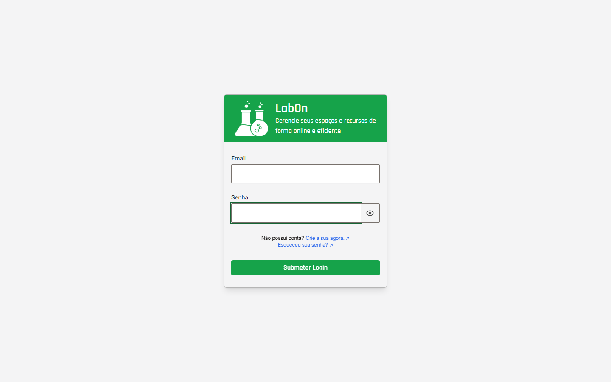

# Manual de uso do LabOn

## Visão geral

Este manual explica como usar o LabOn nas áreas de **Administrador**, **Mentor** e **Mentorado**. Ele prioriza os nomes que aparecem na tela, os pré-requisitos de cada jornada, o resultado esperado e a forma segura de sair quando algo não puder continuar.

O endereço da aplicação é fornecido pela instituição. Para entrar, use uma conta habilitada e uma credencial recebida por canal autorizado. Uma solicitação de cadastro ainda pendente não libera o acesso imediatamente.

### Metadados deste manual

Versão do manual: `2026-09-23.1`

Produto validado: `8c2a8bd173723b8b154aad03da2f511499fbb83b`

Atualizado em: `2026-09-23`

Responsável pela revisão: `nathannmvr`

O responsável é o identificador público do usuário autenticado no GitHub e atribuído à issue #220 nesta execução. Isso não representa aprovação humana final. As evidências da pilha sintética, das capturas e das limitações observadas estão no artefato de especificação de T011; nenhum segredo, credencial real ou token é parte do manual.

### Pré-requisitos gerais

- Ter o endereço da aplicação fornecido pela instituição.
- Ter uma conta habilitada, quando a jornada exigir autenticação.
- Ter recebido a credencial por um canal autorizado; não use credenciais de exemplo deste documento.
- Saber qual dos três perfis foi aprovado para a conta: Administrador, Mentor ou Mentorado.
- Para cadastro ou recuperação, ter acesso aos dados e ao email que a própria tela solicitar.

## J01 — Entender o acesso e escolher o ponto de entrada

**Quem pode executar:** Administrador, Mentor e Mentorado, além de visitante que precise solicitar acesso ou recuperar uma conta.

**Pré-requisitos:** endereço fornecido pela instituição e, para login, conta habilitada e credencial recebida por canal autorizado.

**Onde começar:** tela inicial de login da aplicação.

**Passos:** siga a lista numerada desta seção.

**Resultado esperado:** a pessoa encontra o ponto de entrada correspondente ao seu estado e perfil.

**Erros comuns:** endereço incorreto, conta ainda pendente ou perfil diferente do esperado.

**Saída segura:** permaneça no login, use o retorno visível e não tente contornar permissões.

### Quem pode executar

Qualquer pessoa que precise entrar no LabOn, solicitar cadastro ou recuperar o acesso. O destino após o login depende do perfil habilitado e, quando aplicável, da página que a pessoa pretendia abrir.

### Pré-requisitos

Tenha o endereço fornecido pela instituição. Para fazer login, tenha uma conta habilitada e sua credencial. Se ainda não tiver conta, tenha os dados necessários para solicitar o perfil **Mentor** ou **Mentorado**. O cadastro de **Administrador** não é feito pelo formulário público.

### Onde começar

Abra o endereço da aplicação e permaneça na tela inicial de login. Os controles principais são **Email**, **Senha** e **Submeter Login**. A mesma tela oferece **Crie a sua agora.** para solicitar cadastro e **Esqueceu sua senha?** para iniciar a recuperação.

### Passos

1. Confira se está no endereço fornecido pela instituição.
2. Se já possui uma conta habilitada, preencha **Email** e **Senha** e selecione **Submeter Login**.
3. Se ainda não possui conta, escolha **Crie a sua agora.** e siga [Solicitar cadastro](acesso-e-conta.md#j02-cadastro). Aguarde a decisão; o envio não habilita o acesso por si só.
4. Se não consegue usar a senha, escolha **Esqueceu sua senha?** e siga [recuperação de senha](acesso-e-conta.md#j05-senha-saida).
5. Depois do login, confirme que a área e as opções correspondem ao seu perfil. Continue por [Administrador](#percurso-administrador), [Mentor](#percurso-mentor) ou [Mentorado](#percurso-mentorado).

### Resultado esperado

Uma credencial válida leva à área correspondente ao perfil. Se a pessoa tiver sido encaminhada para uma página protegida antes do login, o sistema pode retornar a esse destino depois da autenticação. Uma conta pendente, desabilitada ou inexistente não deve ser tratada como conta habilitada.

### Erros comuns

- Usar um endereço diferente do fornecido pela instituição.
- Tentar entrar antes da aprovação do cadastro.
- Confundir o perfil aprovado com as opções exibidas após o login.
- Receber a tela de troca obrigatória de senha no primeiro acesso e tentar operar antes de concluí-la.
- Interpretar uma mensagem de credencial como falha de uma jornada administrativa.

### Saída segura

Se não puder entrar, permaneça na tela inicial e use [Acesso e conta](acesso-e-conta.md#j04-primeiro-acesso) ou a recuperação de senha. Se já estiver autenticado e precisar encerrar o uso, abra **Conta** e selecione **Sair**. Em caso de falha, use [Solução de problemas](solucao-de-problemas.md#j11-falhas); não tente contornar uma permissão por outro endereço.

## Percurso por perfil

As seções abaixo são pontos de partida. As opções podem depender do estado da conta, do vínculo e dos registros existentes. A [matriz de perfis e permissões](perfis-e-permissoes.md#perfis) mostra as opções visíveis e os limites de cada área.

### Administrador

**Pré-requisitos:** conta administrativa habilitada, credencial recebida por canal autorizado e, no primeiro acesso, disponibilidade para concluir a troca obrigatória de senha.

**Percurso:**

1. Comece por [fazer login e concluir o primeiro acesso](acesso-e-conta.md#j04-primeiro-acesso).
2. Para preparar a operação, siga [receber o ambiente e preparar a base](administrador.md#j06-preparar-operacao).
3. Use [usuários e aprovações](administrador.md#j03-aprovacao-admin), [materiais](administrador.md#j07-materiais-admin) e [empréstimos](administrador.md#j09-emprestimos-admin) conforme as opções exibidas.
4. Para conferir o que o perfil pode fazer, consulte [perfis e permissões](perfis-e-permissoes.md#perfis).
5. Se uma tela não carregar ou negar acesso, siga [J11 — Recuperar-se de falhas](solucao-de-problemas.md#j11-falhas).

### Mentor

**Pré-requisitos:** cadastro aprovado, conta de Mentor habilitada e, para acompanhar pessoas ou solicitar empréstimos, vínculo e registros correspondentes.

**Percurso:**

1. Comece por [fazer login](acesso-e-conta.md#j04-primeiro-acesso); o cadastro e a aprovação estão descritos em [solicitar cadastro](acesso-e-conta.md#j02-cadastro).
2. Para solicitações, turma e vínculos, siga [o manual do Mentor](mentor.md#j03-aprovacao-mentor).
3. Para consultar materiais ou solicitar empréstimos, siga [consultar materiais](mentor.md#j07-consulta-materiais-mentor) e [solicitar empréstimo](mentor.md#j08-emprestimos-mentor).
4. Para as opções disponíveis ao perfil, consulte [perfis e permissões](perfis-e-permissoes.md#perfis).
5. Para uma lista vazia, falha ou retorno, siga [J11 — Recuperar-se de falhas](solucao-de-problemas.md#j11-falhas).

### Mentorado

**Pré-requisitos:** cadastro aprovado, conta habilitada e vínculo com o responsável quando essa condição for exigida. O acompanhamento de empréstimos depende de haver registros associados à própria conta.

**Percurso:**

1. Comece por [fazer login](acesso-e-conta.md#j04-primeiro-acesso) ou por [solicitar cadastro](acesso-e-conta.md#j02-cadastro).
2. Para pesquisar materiais, siga [consultar materiais](mentorado.md#j07-consulta-materiais-mentorado).
3. Para acompanhar registros pessoais e o próprio vínculo, siga [acompanhar empréstimos](mentorado.md#j08-acompanhamento-mentorado) e [consultar perfil](mentorado.md#j10-perfil-mentorado).
4. Para confirmar os limites do perfil, consulte [perfis e permissões](perfis-e-permissoes.md#perfis).
5. Para falhas ou retorno à sua área, siga [J11 — Recuperar-se de falhas](solucao-de-problemas.md#j11-falhas).

O Mentorado consulta e acompanha seus registros. Este manual não apresenta uma ação de criação, aprovação, recusa ou devolução de empréstimo para esse perfil.

As exportações documentais de usuários e empréstimos ficam disponíveis nos controles **Exportar Excel** e **Exportar PDF** das telas que os exibem. O PDF é a saída equivalente de impressão validada para o produto; não existe uma ação separada de impressão no runtime atual.

## Jornadas comuns

- [Acesso, cadastro, primeiro acesso, senha e saída](acesso-e-conta.md#j02-cadastro).
- [Perfis, menus e permissões](perfis-e-permissoes.md#perfis).
- [Recuperação de falhas e retornos seguros](solucao-de-problemas.md#j11-falhas).

## Navegação do manual

Use os links abaixo para retornar ao índice ou trocar de contexto:

- [Acesso e conta](acesso-e-conta.md#j04-primeiro-acesso)
- [Manual do Administrador](administrador.md#j06-preparar-operacao)
- [Manual do Mentor](mentor.md#j03-aprovacao-mentor)
- [Manual do Mentorado](mentorado.md#j07-consulta-materiais-mentorado)
- [Perfis e permissões](perfis-e-permissoes.md#perfis)
- [Solução de problemas](solucao-de-problemas.md#j11-falhas)

