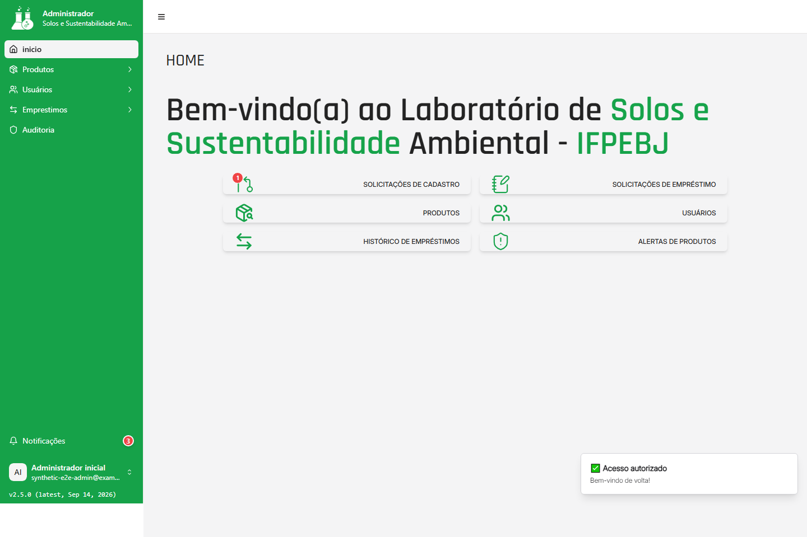
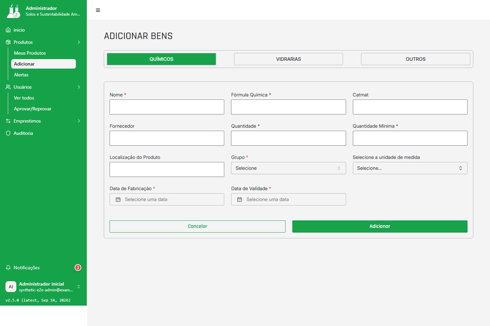
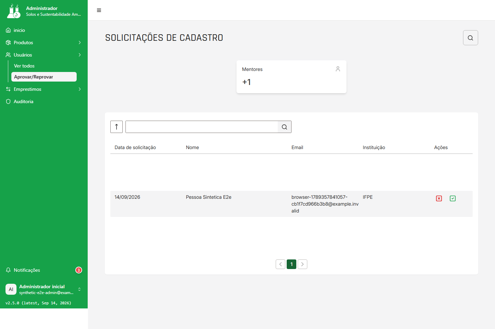

# Manual do Administrador

Esta página cobre as variantes administrativas das jornadas J03, J06, J07, J09 e J10: receber o acesso ao ambiente, preparar a operação, avaliar cadastros, consultar usuários, administrar materiais, acompanhar alertas e históricos, decidir empréstimos e registrar devoluções.

Para entrar no sistema e cumprir a troca obrigatória de senha, consulte [Acesso e conta](acesso-e-conta.md#j04-primeiro-acesso). Para situações de sessão expirada, acesso negado, erro de serviço ou registro ausente, consulte [Solução de problemas](solucao-de-problemas.md#j11-falhas). O [índice do manual](README.md#j01-acesso) reúne o percurso dos três perfis.

Versão do manual: `2026-09-14.2`

Produto validado: `2c78dbe1c3ec41f4004f53c42be8fed556080192`

Atualizado em: `2026-09-14`

Responsável pela revisão: `nathannmvr`

## Limites do perfil

As instruções desta página são para o perfil **Administrador**. A aplicação e o servidor restringem ao Administrador as listas administrativas, a alteração de status de usuários, o cadastro e a edição de materiais, a consulta global de empréstimos e as decisões de aprovação ou reprovação.

O menu administrativo apresenta **Início**, **Produtos** (com **Meus Produtos**, **Adicionar** e **Alertas**), **Usuários** (com **Ver todos** e **Aprovar/Reprovar**) e **Empréstimos** (com **Solicitações** e **Histórico**). Use esses nomes para começar; não digite endereços internos como forma de contornar uma permissão.

Preparação e configuração operacional nesta página significam conferir o ambiente e organizar registros pela interface. Não incluem instalação, configuração técnica do servidor, variáveis de ambiente, banco de dados ou qualquer procedimento de implantação.

## J06 — Receber o ambiente e o acesso

**Quem pode executar:** Administrador com conta provisionada pela instituição.

**Pré-requisitos:** endereço institucional, ambiente disponível e credencial inicial entregue por canal seguro.

**Onde começar:** tela de login e depois a área administrativa.

**Passos:** siga as listas numeradas de confirmação do ambiente e montagem da base operacional.

**Resultado esperado:** a área administrativa e seus grupos de operação ficam disponíveis para conferência.

**Erros comuns:** ambiente indisponível, troca de senha pendente, acesso negado ou menu incompleto.

**Saída segura:** pare sem repetir credenciais, use `Conta > Sair` ou o retorno visível e procure a instituição.

### Ação: confirmar o ambiente disponibilizado

**Quem pode executar**

O operador com perfil Administrador provisionado pela instituição. Uma pessoa que ainda aguarda aprovação não pode executar esta ação.

**Pré-requisitos**

- O endereço do aplicativo foi fornecido por um canal institucional autorizado.
- A instituição confirmou que o ambiente está disponível.
- A conta Administrador e a credencial inicial foram entregues por canal seguro, fora deste manual.

**Onde começar**

Abra o endereço fornecido pela instituição e permaneça na tela de entrada. Não use exemplos de credenciais deste documento.

**Passos**

1. Confirme se o endereço aberto é o informado pela instituição e se a página de entrada exibe os campos de email e senha.
2. Informe a credencial recebida no canal autorizado e envie o formulário.
3. Se o sistema encaminhar para a troca obrigatória de senha, siga [a jornada de primeiro acesso](acesso-e-conta.md#j04-primeiro-acesso) e conclua a troca antes de tentar operar.
4. Entre novamente com a nova senha, quando solicitado.
5. Confirme que a área **Início** do Administrador e os grupos **Produtos**, **Usuários** e **Empréstimos** estão disponíveis.

**Resultado esperado**

A sessão é reconhecida como Administrador e a área administrativa fica disponível para as operações deste manual.

**Erros comuns**

- A página não abre ou não conclui o login: o ambiente ou a conexão pode estar indisponível.
- O sistema retorna à troca de senha: a credencial ainda está marcada para primeiro acesso.
- A área mostra **Acesso negado**: a sessão não tem o perfil necessário ou não está válida.
- Um menu esperado não aparece: a conta, a versão disponível ou o ambiente pode não corresponder ao cenário documentado.

**Saída segura**

Não repita uma credencial desconhecida nem registre senha, token ou cookie em chamados. Pare, preserve a mensagem apresentada e contate a instituição. Se a sessão estiver aberta, use **Conta > Sair**.

### Ação: montar a base operacional

**Quem pode executar**

Administrador com acesso confirmado.

**Pré-requisitos**

- A sessão Administrador foi concluída sem troca de senha pendente.
- Há registros sintéticos ou registros autorizados para conferência.
- A instituição informou quais usuários, vínculos e materiais devem estar disponíveis para o início da operação.

**Onde começar**

Comece em **Início** e use os atalhos do menu **Usuários** e **Produtos**.

**Passos**

1. Abra **Usuários > Ver todos** e confirme se a listagem carrega.
2. Pesquise alguns nomes conhecidos e confira, para cada registro necessário, o tipo de usuário e o status visível.
3. Abra **Produtos > Meus Produtos** e confirme se o catálogo inicial aparece.
4. Confira os tipos exibidos no filtro: **Todos**, **Vidrarias**, **Químicos** e **Outros**.
5. Separe os cadastros que ainda dependem de decisão em **Usuários > Aprovar/Reprovar** e os empréstimos pendentes em **Empréstimos > Solicitações**.
6. Se houver material necessário que não exista, cadastre-o pela ação **Adicionar**, descrita em [cadastrar material](#j07-materiais-admin).

**Resultado esperado**

O Administrador sabe quais usuários estão habilitados, quais solicitações aguardam decisão e quais materiais estão disponíveis para uso, sem depender de configuração interna do aplicativo.

**Erros comuns**

- A lista fica vazia após uma falha de carregamento: vazio não prova que não existam registros.
- Um usuário ou material não aparece após uma busca: remova o filtro, confira a grafia e tente carregar a lista novamente.
- O serviço informa que a operação não pode ser concluída: a base operacional pode estar indisponível ou a conta pode não ter o alcance esperado.

**Saída segura**

Não altere status, cadastre material ou decida uma solicitação para “testar” a tela. Use **Voltar** ou outro item do menu; para uma falha, siga [a recuperação comum](solucao-de-problemas.md#j11-falhas).

## J03 — Avaliar solicitações de cadastro

### Ação: aprovar ou reprovar uma solicitação

**Quem pode executar**

Administrador. O servidor exige essa permissão para aprovar ou reprovar o cadastro.

**Pré-requisitos**

- A sessão Administrador está ativa.
- A solicitação aparece na lista da tela, com dados suficientes para a decisão.
- Você confirmou com a instituição o critério para habilitar ou rejeitar o solicitante.

**Onde começar**

Abra **Usuários > Aprovar/Reprovar**. A página se chama **Solicitações de Cadastro**.

**Passos**

1. Confira a linha pelo **Data de solicitação**, **Nome**, **Email** e **Instituição**.
2. Use a busca pelo nome e o controle de ordenação para localizar a solicitação, se necessário.
3. Antes de decidir, confirme que a linha pertence ao solicitante correto e que o pedido ainda está pendente.
4. Para habilitar o acesso, acione o controle identificado como **Aprovar** para aquela pessoa.
5. Para negar o acesso, acione o controle identificado como **Recusar**; essa é a ação de reprovação mostrada pela tela.
6. Aguarde a atualização da lista e leia a notificação de solicitação aceita ou rejeitada.

**Resultado esperado**

Uma aprovação deixa o usuário habilitado para acesso; uma reprovação deixa o usuário desabilitado. A lista é carregada novamente após a operação.

O alcance da lista é o conjunto de solicitações retornado para a conta e o contexto atual. Não conclua que todo cadastro pendente da instituição está visível apenas porque a tela abriu.

**Erros comuns**

- **Nenhuma solicitação de cadastro pendente**: não há registro pendente no conjunto mostrado; isso não confirma que não exista solicitação em outro contexto.
- **Nenhuma solicitação encontrada para os filtros aplicados**: limpe a busca ou altere a ordenação.
- **Você não tem permissão para esta ação**: preserve a sessão e solicite a revisão do perfil; não tente outro endereço.
- A ação informa erro ou a lista não se atualiza: a resposta do serviço pode ter sido persistida sem ser interpretada corretamente pela tela. Não clique novamente sem confirmar o status do usuário em **Ver todos**.
- O registro já foi processado ou não foi encontrado: não repita a decisão.

**Saída segura**

Uma decisão de aprovação ou reprovação não oferece desfazer na tela. Se houver dúvida, não acione o controle. Para cancelar a intenção, use **Voltar** e retorne a **Usuários**; depois de uma resposta ambígua, confirme o registro antes de qualquer nova tentativa.

## J10 — Consultar usuários e alterar o status disponível

### Ação: consultar a lista e o contexto de um usuário

**Quem pode executar**

Administrador.

**Pré-requisitos**

- A sessão Administrador está ativa.
- A lista de usuários está disponível.
- Para abrir um contexto relacionado, o registro possui identificação válida.

**Onde começar**

Abra **Usuários > Ver todos**, na página **Usuários Cadastrados**.

**Passos**

1. Confira os cartões de contagem de **Administradores**, **Mentores** e **Mentorandos**.
2. Leia a tabela pelas colunas **Data de ingresso**, **Nome**, **Tipo de usuário** e **Status**.
3. Digite parte do nome no campo de busca e use o seletor para filtrar por tipo ou por **Habilitado**/**Desabilitado**.
4. Use o controle de ordenação quando precisar alternar a ordem da lista.
5. Para consultar o contexto relacionado, abra o nome do registro ou a própria linha.
6. Use **Voltar** para retornar à lista de usuários quando terminar a consulta.

**Resultado esperado**

Os usuários encontrados são exibidos com seu tipo e status, e o registro escolhido abre a consulta relacionada ao tipo de usuário.

**Erros comuns**

- **Nenhum usuário cadastrado**: a resposta foi uma lista vazia; confirme se esse é o ambiente correto.
- **Nenhum dado disponível para exibição** após um filtro: remova o filtro e a busca antes de concluir que não há registros.
- Falha ao carregar usuários ou o contexto relacionado: use o retry oferecido ou volte para **Início**.
- **Acesso negado**: o servidor não reconheceu a permissão administrativa.

**Saída segura**

Não altere nenhum controle enquanto estiver apenas consultando. Volte para **Usuários** ou **Início**; em uma falha persistente, conserve o código de referência exibido e siga [a jornada de falhas](solucao-de-problemas.md#j11-falhas).

### Ação: habilitar ou desabilitar outro usuário

**Quem pode executar**

Administrador, somente para um usuário diferente da própria conta. O servidor bloqueia a alteração de status por perfis sem essa permissão.

**Pré-requisitos**

- O usuário aparece em **Usuários Cadastrados**.
- Existe uma decisão operacional para alterar o acesso desse usuário.
- Você conferiu o status atual e o novo status pretendido.

**Onde começar**

Na lista **Usuários Cadastrados**, localize o usuário e o controle **Status** da linha.

**Passos**

1. Abra o seletor de status da linha correta.
2. Escolha **Habilitado** para permitir o acesso ou **Desabilitado** para retirar o acesso.
3. Leia a caixa **Alterar Status do Usuário**, que mostra o usuário, o status atual e o novo status.
4. Se a mudança estiver correta, confirme com **Habilitar** ou **Desabilitar**.
5. Se a mudança não estiver correta, escolha **Cancelar** na caixa de confirmação.
6. Aguarde o fim da atualização e confira o novo status na linha.

**Resultado esperado**

O status do outro usuário é atualizado na lista e as permissões de acesso correspondentes passam a refletir a decisão.

**Erros comuns**

- A própria conta não pode ser alterada: o seletor mostra somente o status atual.
- O status não muda após confirmação: o serviço pode ter recusado a operação; a lista mantém o valor anterior.
- **Status inválido** ou acesso negado: não tente outro valor nem outro endereço.
- A lista falha ao carregar: não use uma linha antiga para decidir.

**Saída segura**

**Cancelar** fecha a confirmação sem aplicar a mudança. Depois de confirmar uma alteração, não há desfazer documentado nesta tela: valide o resultado antes de tomar outra decisão e use **Voltar** se precisar sair.

## J07 — Cadastrar materiais

**Quem pode executar:** Administrador para cadastrar, editar e consultar materiais na área administrativa; Mentor e Mentorado para consultar os materiais nas páginas dos seus perfis.

**Pré-requisitos:** sessão habilitada; para o Administrador, dados autorizados do material; para Mentor e Mentorado, catálogo disponível para consulta.

**Onde começar:** Administrador em **Produtos > Adicionar** ou **Produtos > Meus Produtos**; Mentor e Mentorado em **Pesquisar Material**.

**Passos:**

1. Escolha a área correspondente ao seu perfil e confirme o tipo de consulta ou operação disponível.
2. Pesquise o material ou preencha os campos exigidos somente quando o cadastro estiver autorizado.
3. Confira o resultado e retorne à pesquisa antes de iniciar outra ação.

**Resultado esperado:** o Administrador pode confirmar o cadastro, a edição ou a consulta conforme o controle exibido; Mentor e Mentorado visualizam somente os detalhes permitidos.

**Erros comuns:** catálogo vazio, filtro sem correspondência, campo inválido, material não encontrado, falha de serviço ou ação de edição ausente para o perfil.

**Saída segura:** use **Cancelar**, **Voltar** ou o menu do perfil sem enviar uma alteração incerta; não tente cadastrar ou editar material fora da área autorizada.

### Ação: adicionar um material ao catálogo

**Quem pode executar**

Administrador. O cadastro de material exige autorização administrativa no servidor.

**Pré-requisitos**

- A sessão Administrador está ativa.
- Você recebeu os dados do material por um canal autorizado.
- Nome, quantidade e quantidade mínima estão definidos; as datas e os campos específicos do tipo estão disponíveis quando exigidos.

**Onde começar**

Abra **Produtos > Adicionar**. A página se chama **Adicionar Bens**.

**Passos**

1. Escolha a aba do tipo de material: **Químicos**, **Vidrarias** ou **Outros**.
2. Para qualquer tipo, preencha **Nome**, **Quantidade**, **Quantidade Mínima** e as datas de **Data de Fabricação** e **Data de Validade**.
3. Preencha **Fornecedor** ou **Fornecedor/Marca** e a **Localização** quando esses dados forem conhecidos.
4. Na aba **Químicos**, preencha **Fórmula Química**, **Grupo** e a **unidade de medida**; **Catmat** é um campo opcional da tela.
5. Na aba **Vidrarias**, confira **Capacidade (ml)** e, quando aplicável, selecione **Formato**, **Material**, **Altura** e **Graduada**.
6. Revise nomes, números, datas e a quantidade mínima antes do envio.
7. Acione **Adicionar** uma única vez e aguarde a notificação.

**Resultado esperado**

O produto é criado e a tela informa **Produto criado**. A descrição orienta verificar o estoque para validação; confirme o registro em **Produtos > Meus Produtos**.

**Erros comuns**

- Nome curto ou longo demais, quantidade não positiva ou quantidade mínima inválida.
- Fórmula, grupo, unidade, capacidade ou data inválida para o tipo escolhido.
- Dados informados precisam de revisão no formulário ou no serviço.
- Erro de conexão ou de serviço após o envio: o resultado do cadastro pode não estar confirmado.

**Saída segura**

Revise os campos indicados e envie novamente somente depois de confirmar se um registro foi criado. O botão **Cancelar** aparece nos formulários, mas nesta versão não limpa nem navega de forma confiável; para sair sem enviar, não acione **Adicionar** e use o menu ou o retorno para a pesquisa.

### Ação: consultar e editar um material

**Quem pode executar**

Administrador para editar; perfis autenticados podem ter uma consulta própria, mas esta ação administrativa começa na área do Administrador.

**Pré-requisitos**

- O material já existe no catálogo.
- Para editar, há uma decisão autorizada sobre os dados que devem mudar.
- A sessão Administrador está ativa.

**Onde começar**

Abra **Produtos > Meus Produtos**, na página de pesquisa do Administrador.

**Passos**

1. Use a busca pelo nome e o seletor **Todos**, **Vidrarias**, **Químicos** ou **Outros**.
2. Se necessário, alterne a ordenação e localize a linha do material.
3. Abra a linha para consultar **Verificação - Administrador**.
4. Leia as informações exibidas antes de editar, incluindo item, fornecedor, grupo e situação.
5. Acione **Editar Produto**.
6. Altere somente os campos necessários: **CATMAT**, **Nome do Produto**, **Quantidade**, **Quantidade Mínima**, **Fornecedor**, **Localização**, datas ou **Status**.
7. Selecione o status exibido pela tela, como **Disponível**, **Em Uso**, **Danificado**, **Emprestado**, **Esgotado**, **Vencido** ou **Perdido**.
8. Revise a alteração e acione **Salvar Alterações**.

**Resultado esperado**

O sistema informa **Produto atualizado**, fecha a edição e recarrega os dados do material. Se nenhum campo mudou, informa **Nenhuma alteração detectada** e não envia uma atualização.

**Erros comuns**

- Identificador ou material não encontrado: volte para a pesquisa e localize o registro novamente.
- Data, quantidade ou status inválido: corrija o campo antes de salvar.
- Falha de serviço ou de autorização: a edição não deve ser presumida como concluída.
- Um dado visível no detalhe não possui campo de edição: ele não faz parte desta ação.

**Saída segura**

Use **Cancelar** no diálogo para fechar sem enviar. Depois de **Salvar Alterações**, não há desfazer documentado: confirme o detalhe atualizado e não repita o envio por incerteza. Retorne à pesquisa se a consulta não puder continuar.

### Ação: consultar alertas operacionais

**Quem pode executar**

Administrador. A consulta de alertas é protegida no servidor para esse perfil.

**Pré-requisitos**

- A sessão Administrador está ativa.
- Existem materiais cadastrados para a consulta.

**Onde começar**

Abra **Produtos > Alertas**. A página se chama **Acompanhamento**.

**Passos**

1. Leia os cartões **Produtos com Alertas**, **Produtos com Alerta de Validade** e **Produtos com Alerta de Estoque**.
2. Confira, na tabela, **Nome**, **Quantidade Atual**, **Quantidade Mínima**, **Data de Validade** e **Status**.
3. Use o campo de busca para localizar um material pelo nome.
4. Use o filtro **Todos**, **Validade** ou **Estoque** para restringir a lista.
5. Se necessário, alterne a ordenação.
6. Abra a linha do material para conferir seus dados antes de decidir uma reposição ou outra providência operacional.

**Resultado esperado**

São exibidos materiais retornados como alerta por quantidade igual ou inferior ao mínimo ou por proximidade do vencimento. A tela mostra os valores que justificam a conferência; ela não executa reposição automaticamente.

**Erros comuns**

- **Nenhum alerta de produto encontrado**: não há alerta retornado para o conjunto consultado.
- **Nenhum produto encontrado para os filtros aplicados**: limpe o filtro ou a busca.
- Falha de rede ou serviço: use **Tentar novamente** quando disponível.
- Um valor de estoque ou data parece incompatível com o filtro: confira o detalhe do produto e não trate o rótulo do filtro como prova isolada.

**Saída segura**

Use **Voltar** para retornar à pesquisa de materiais. Não altere estoque ou status apenas para remover um alerta; registre a dúvida e encaminhe-a ao responsável pela operação.

### Ação: consultar o histórico de movimentações de um material

**Quem pode executar**

Administrador.

**Pré-requisitos**

- O material existe e pode ser aberto pela pesquisa.
- A sessão Administrador está ativa.
- Para obter linhas de histórico, o material precisa ter movimentações registradas.

**Onde começar**

Em **Produtos > Meus Produtos**, abra o material e consulte a seção **Histórico de Movimentações** da verificação.

**Passos**

1. Confira o nome do item e o estoque apresentado no detalhe.
2. Leia as linhas por **Data**, **Utilizador**, **Identificador**, **Lote**, **Quantidade** e **Unidade**.
3. Use o campo **Buscar** para localizar uma pessoa, identificador ou registro exibido.
4. Use o filtro de **Status** somente entre as opções que a tela apresentar, como **Todos**, **Emprestado**, **Devolvido**, **Atrasado** e **Perdido**.
5. Consulte os cartões de **Total de Empréstimos** e **Quantidade Emprestada** quando estiverem disponíveis.
6. Retorne à pesquisa de materiais depois de concluir a conferência.

**Resultado esperado**

O histórico disponível mostra as movimentações retornadas pelo serviço e seus totais. Uma lista vazia significa que não há movimentação apresentada para o material naquele contexto.

**Erros comuns**

- **Nenhuma movimentação encontrada**: não há linha retornada para o material ou para o filtro aplicado.
- **Selecione um registro para consultar**: volte para **Meus Produtos** e abra uma linha válida.
- **Produto não encontrado**: o registro pode ter sido removido ou o contexto pode estar desatualizado.
- O histórico não carrega: use o retry oferecido e não trate a tela vazia como confirmação de ausência.
- A tela de histórico pode apresentar campos incompletos; gráficos e filtros de período que não funcionem não são dados operacionais disponíveis.

**Saída segura**

Use **Voltar** para a pesquisa. Não altere um produto para corrigir uma data exibida no histórico e não repita uma ação de empréstimo por causa de uma linha que não carregou.

## J09 — Decidir empréstimos

**Quem pode executar:** Administrador com sessão habilitada; a decisão e o registro de devolução são operações administrativas protegidas pelo servidor.

**Pré-requisitos:** solicitação ou empréstimo retornado pela lista, status conferido e itens do registro disponíveis para consulta.

**Onde começar:** **Empréstimos > Solicitações** para decidir ou **Empréstimos > Histórico** para acompanhar e registrar uma devolução.

**Passos:**

1. Confira o solicitante, os itens e o status do empréstimo.
2. Siga a ação disponível para aprovar, recusar, acompanhar ou registrar a devolução.
3. Aguarde a atualização e confirme o novo status antes de iniciar outra operação.

**Resultado esperado:** a decisão, o histórico ou a devolução refletem o resultado informado pela tela e pelo serviço.

**Erros comuns:** lista vazia, estoque insuficiente, empréstimo já processado, botão indisponível, erro de serviço ou autorização.

**Saída segura:** não repita uma decisão ou devolução ambígua; use **Voltar** ou **Início** e confirme o status no histórico.

### Ação: aprovar ou reprovar uma solicitação de empréstimo

**Quem pode executar**

Administrador. O servidor restringe as decisões de empréstimo a esse perfil.

**Pré-requisitos**

- A sessão Administrador está ativa.
- Há uma solicitação com status **Pendente**.
- O solicitante, os itens e as quantidades foram conferidos; para aprovar, há estoque suficiente.

**Onde começar**

Abra **Empréstimos > Solicitações**. A página se chama **Solicitações de Empréstimos**.

**Passos**

1. Confira na linha a **Data de solicitação**, o **Nome** e o **Email** do solicitante.
2. Abra a solicitação para examinar os produtos e as quantidades no histórico do empréstimo.
3. Retorne à lista de solicitações e confirme que o pedido ainda está pendente.
4. Para autorizar, acione **Aprovar**; confirme antes que todos os itens têm estoque suficiente.
5. Para negar, acione **Recusar**; essa é a ação de reprovação exibida pela lista.
6. Aguarde a atualização da lista e a notificação de solicitação aceita ou rejeitada.

**Resultado esperado**

Ao aprovar, o empréstimo passa a **Aprovado**, registra o Administrador responsável e reduz o estoque dos itens. Ao reprovar, passa a **Rejeitado** e não é disponibilizado para uso. A decisão não oferece desfazer nesta interface.

**Erros comuns**

- **Nenhuma solicitação de empréstimo pendente**: não há pedido pendente retornado pela lista.
- Estoque insuficiente: não aprove; confira o material e volte à lista.
- O empréstimo já foi processado ou não foi encontrado: não repita a decisão.
- Erro de conexão, servidor ou autorização: a tela deve manter o registro para nova conferência; não clique repetidamente.

**Saída segura**

Antes de clicar, pare se houver dúvida sobre solicitante, itens ou estoque. Depois de uma resposta ambígua, abra **Empréstimos > Histórico** e confirme o status. Use **Voltar** ou **Início** sem tentar contornar a autorização.

### Ação: consultar o histórico global de empréstimos

**Quem pode executar**

Administrador.

**Pré-requisitos**

- A sessão Administrador está ativa.
- Há empréstimos registrados ou uma razão para confirmar que a lista está vazia.

**Onde começar**

Abra **Empréstimos > Histórico**. A página se chama **Histórico de Empréstimos**.

**Passos**

1. Leia os cartões de **Aprovados**, **Pendentes** e **Rejeitados**.
2. Use o filtro **Todos**, **Aprovado**, **Pendente** ou **Rejeitado**.
3. Use o campo de busca e a ordenação disponíveis na tela para localizar ou organizar os registros.
4. Abra uma linha para consultar o solicitante, o responsável, os itens e o status do empréstimo.
5. Se a linha estiver pendente e precisar de decisão, retorne a **Empréstimos > Solicitações** para aprovar ou reprovar.
6. Se o empréstimo aprovado ainda não tiver devolução, siga [registrar devolução](#j09-registrar-devolucao).

**Resultado esperado**

O histórico apresenta os empréstimos do escopo administrativo e permite consultar seus status e detalhes. Uma lista vazia é um resultado de consulta somente quando a resposta do serviço foi carregada com sucesso.

**Erros comuns**

- **Nenhum empréstimo registrado no sistema**: a resposta carregada não contém registros.
- **Nenhum empréstimo encontrado para os filtros aplicados**: limpe o filtro ou a busca.
- Falha ao carregar: use **Tentar novamente** ou volte para **Início**.
- Detalhe sem registro ou identificador válido: volte ao histórico e abra uma linha existente.

**Saída segura**

Não aprove, rejeite ou devolva um empréstimo a partir de uma linha cujo status não esteja confirmado. Volte para o histórico ou para **Início**; em caso de sessão expirada, siga [a entrada novamente](acesso-e-conta.md#j05-senha-saida).

### Ação: registrar a devolução de um empréstimo

**Quem pode executar**

Administrador, no fluxo desta página. O serviço também reconhece o perfil Mentor para a operação em outros contextos, mas esta instrução não amplia a permissão nem cria um caminho para ele.

**Pré-requisitos**

- A sessão Administrador está ativa.
- O empréstimo está com status **Aprovado**.
- O empréstimo ainda não possui devolução registrada.
- Os itens e o solicitante foram conferidos no detalhe correto.

**Onde começar**

Em **Empréstimos > Histórico**, abra o empréstimo aprovado. No detalhe, use **Registrar Devolução** quando o botão estiver disponível.

**Passos**

1. Confira o título do detalhe, o solicitante, o responsável, a data de realização e os itens selecionados.
2. Verifique se o status é **Aprovado** e se não aparece **Empréstimo Devolvido** ou **Devolvido**.
3. Revise as categorias de itens exibidas: **Químicos**, **Vidrarias** e **Outros**.
4. Confirme que está tratando o empréstimo completo; o fluxo atual não oferece registro parcial de itens pelo botão global.
5. Acione **Registrar Devolução** uma única vez.
6. Aguarde a atualização do detalhe e leia a notificação de devolução registrada.

**Resultado esperado**

O empréstimo passa a exibir a devolução registrada com a data correspondente. A quantidade dos produtos é restaurada pelo serviço; se um produto estiver vencido, seu status continua refletindo o vencimento, em vez de ser tratado como disponível.

**Erros comuns**

- O botão não aparece: o empréstimo pode não estar aprovado ou já pode ter sido devolvido.
- **Apenas empréstimos aprovados podem ser devolvidos**: volte ao histórico e confira o status.
- **Este empréstimo já foi devolvido**: não repita a operação.
- Empréstimo, item ou sessão não encontrados: retorne à lista e abra um registro atual.
- Falha de serviço ou autorização: a data e o estoque não devem ser presumidos como atualizados.

**Saída segura**

O registro é uma ação de conclusão e não oferece desfazer nesta interface. Não clique novamente depois de uma resposta ambígua; confirme o status e a data no histórico. Se não quiser concluir, use **Voltar** sem acionar o botão.

## Próximos passos e encerramento

Depois de concluir uma operação, retorne à lista correspondente e confira o resultado antes de iniciar outra. Use [Acesso e conta](acesso-e-conta.md#j05-senha-saida) para sair e [Solução de problemas](solucao-de-problemas.md#j11-falhas) para diferenciar lista vazia, falha de serviço, acesso negado e sessão expirada.

As instruções acima descrevem somente ações visíveis nas telas administrativas e autorizadas pelo servidor. Não use uma rota, um endpoint ou uma operação que não apareça no percurso indicado como substituto de uma permissão ausente.
