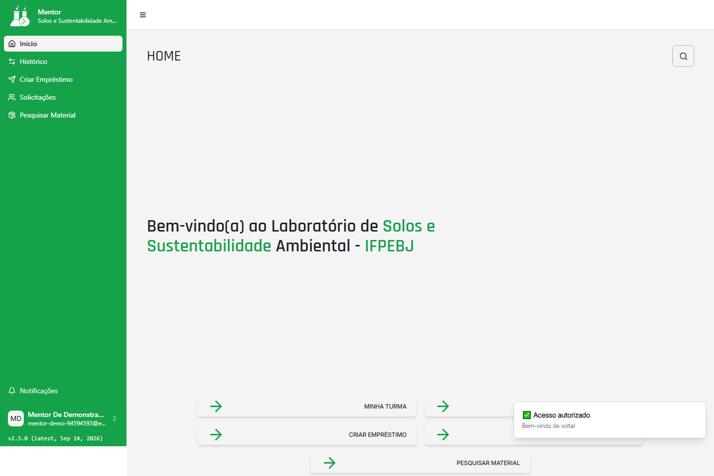
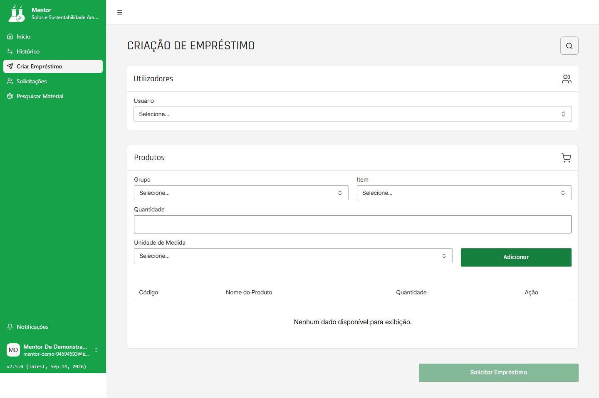

# Manual do Mentor

Este guia descreve as ações disponíveis ao perfil `Mentor`: acompanhar a turma, tratar solicitações de cadastro de seus dependentes, consultar materiais e solicitar ou acompanhar empréstimos. É necessário entrar com uma conta habilitada de Mentor; a guarda do sistema impede o acesso de outros perfis.

Para entrar ou resolver problemas de credencial, consulte [Acesso e conta](acesso-e-conta.md#j04-primeiro-acesso). Para encerrar a sessão, use [senha e saída](acesso-e-conta.md#j05-senha-saida).
Volte ao [índice do manual](README.md#visao-geral) para escolher outra jornada ou perfil.

Versão do manual: `2026-09-23.1`

Produto validado: `8c2a8bd173723b8b154aad03da2f511499fbb83b`

Atualizado em: `2026-09-23`

Responsável pela revisão: `nathannmvr`

## J03 — Avaliar solicitações de cadastro

### Quem pode executar

O Mentor responsável pode consultar e decidir solicitações de Mentorados vinculados a ele. A tela não dá ao Mentor alcance sobre solicitações de outros responsáveis. O Administrador tem uma área própria; não use esta jornada para executar uma aprovação administrativa.

### Pré-requisitos

- Conta de Mentor habilitada e sessão ativa.
- Um Mentorado precisa ter solicitado cadastro informando este Mentor como responsável.
- A solicitação ainda deve estar pendente.

Quando a solicitação for aprovada, o vínculo passa a permitir que o Mentorado apareça na turma ativa e na seleção de usuário da criação de empréstimo. Solicitações pendentes ou rejeitadas não ficam disponíveis para essas ações.

### Onde começar

No menu lateral, abra **Solicitações**. A página se chama **Solicitações de Cadastro**.

### Passos

1. Aguarde o carregamento da lista de solicitações pendentes.
2. Confira as colunas de data, nome, e-mail e instituição para identificar o pedido.
3. Use a pesquisa para localizar um nome e o controle de ordenação quando precisar reorganizar a lista.
4. Na linha correta, use a ação **Aprovar** ou **Recusar**.
5. Aguarde a mensagem de resultado e a atualização da lista antes de tratar outra solicitação.

### Resultado esperado

**Aprovar** habilita o Mentorado e a solicitação deixa de aparecer como pendente. **Recusar** deixa o cadastro desabilitado e também o retira da lista de pendências. O vínculo e o status devem ser conferidos na **Minha Turma** antes de criar um empréstimo.

### Erros comuns

- **Nenhuma solicitação de cadastro pendente.** A lista está vazia porque não há pedido pendente no vínculo retornado; isso não significa que nenhum usuário possa solicitar cadastro no futuro.
- **Nenhuma solicitação encontrada para os filtros aplicados.** Limpe a pesquisa e confirme novamente a lista.
- Depois de aprovar, a tela pode exibir erro ou não recarregar corretamente mesmo que a decisão já tenha sido gravada. Não clique repetidamente: volte para **Minha Turma**, atualize a consulta e confirme o status. Se a inconsistência continuar, registre-a para suporte.
- Uma solicitação fora do vínculo do Mentor não deve ser aprovada ou recusada por esta jornada.

### Saída segura

Use **Voltar** para retornar à **Minha Turma**. Se não puder continuar com a sessão, use **Conta > Sair**. Não tente ampliar o alcance da tela por endereço digitado ou por ferramenta técnica.

## J07 — Consultar materiais

### Quem pode executar

O Mentor habilitado pode pesquisar e consultar materiais. Esta visão não oferece cadastro, edição ou exclusão de produtos.

### Pré-requisitos

- Sessão de Mentor ativa.
- Catálogo de materiais disponível para consulta.

### Onde começar

No menu lateral, abra **Pesquisar Material**.

### Passos

1. Digite parte do nome no campo de pesquisa, se quiser restringir os resultados.
2. Escolha o tipo **Todos**, **Vidrarias**, **Químicos** ou **Outros**, quando necessário.
3. Use o controle de ordenação para alternar a ordem dos resultados.
4. Selecione a linha do material para abrir **Verificação**.
5. Consulte os dados exibidos, como tipo, quantidade, unidade e status, e retorne à pesquisa quando terminar.

### Resultado esperado

Os materiais que correspondem ao nome e ao tipo selecionados aparecem em uma lista de consulta. A tela de **Verificação** mostra o detalhe disponível para a visão do Mentor, sem apresentar uma ação de edição.

### Erros comuns

- **Nenhum dado disponível para exibição** pode significar que não há correspondência para o texto/tipo escolhido ou que o carregamento do catálogo falhou; limpe a pesquisa e volte a conferir antes de concluir que o material não existe.
- Se a lista continuar vazia quando um material conhecido deveria estar disponível, trate o resultado como indisponibilidade a confirmar. Esta tela pode não apresentar um controle de erro equivalente a **Tentar novamente**.
- Um detalhe que não possa ser carregado deve ser abandonado com **Voltar**, sem tentar alterar o material.

### Saída segura

No detalhe, use **Voltar** para retornar a **Pesquisar Material**. Para sair completamente, use **Conta > Sair**. A consulta não autoriza o Mentor a criar ou editar materiais.

## J08 — Solicitar e acompanhar empréstimos

**Quem pode executar:** Mentor habilitado para solicitar e acompanhar empréstimos da turma; Mentorado habilitado para acompanhar os próprios empréstimos.

**Pré-requisitos:** sessão habilitada; para o Mentor, Mentorado vinculado e produto disponível; para o Mentorado, histórico pessoal acessível.

**Onde começar:** Mentor em **Criar Empréstimo** ou **Histórico**; Mentorado em **Histórico Pessoal**.

**Passos:**

1. Abra a área correspondente ao seu perfil e confirme os registros ou opções exibidos.
2. Siga a variante detalhada abaixo para solicitar um empréstimo ou consultar um registro existente.
3. Confira o status e use o retorno ao histórico correto antes de iniciar outra ação.

**Resultado esperado:** o Mentor envia ou acompanha solicitações da sua turma; o Mentorado consulta somente os próprios empréstimos, sem criar ou decidir operações.

**Erros comuns:** vínculo ausente, produto indisponível, lista vazia, filtro sem correspondência, status desatualizado ou erro de serviço.

**Saída segura:** use **Voltar** para a área ou histórico do perfil e **Conta > Sair** para encerrar; não tente aprovar ou criar uma operação por uma tela não oferecida.

### Solicitar um empréstimo

#### Quem pode executar

O Mentor habilitado pode montar e enviar uma solicitação para um Mentorado habilitado que esteja vinculado à sua turma. A decisão posterior não pertence ao Mentor.

#### Pré-requisitos

- Sessão de Mentor ativa.
- Pelo menos um Mentorado com status **Habilitado** vinculado ao Mentor.
- Produto disponível no catálogo.
- Quantidade inteira positiva e unidade de medida para cada item.

Mentorados pendentes, recusados ou desabilitados não aparecem como destinatários da solicitação. Se não houver um vínculo habilitado, primeiro é necessário concluir o fluxo de cadastro/aprovação aplicável.

#### Onde começar

No menu lateral, abra **Criar Empréstimo**. A página se chama **Criação de Empréstimo**.

#### Passos

1. Em **Utilizadores**, selecione o Mentorado habilitado que receberá o empréstimo.
2. Em **Produtos**, selecione o **Grupo** e depois o **Item**.
3. Informe uma **Quantidade** inteira positiva e escolha a **Unidade de Medida**.
4. Use **Adicionar** para incluir o item na tabela de produtos selecionados. Repita os passos para outros itens, se necessário.
5. Revise a tabela; use **Remover** para tirar um item antes do envio.
6. Quando houver um usuário e pelo menos um item, use **Solicitar Empréstimo**.

O prazo é definido pelo fluxo entregue e não é escolhido em um campo desta tela.

#### Resultado esperado

Uma mensagem confirma o envio da solicitação. Ela fica pendente para avaliação do Administrador; o envio não significa aprovação, retirada imediata ou devolução concluída.

#### Erros comuns

- Se **Utilizadores** estiver vazio, não há Mentorado habilitado disponível para este vínculo ou o carregamento falhou. Não selecione um usuário fora da lista.
- **Nenhum dado disponível para exibição** na tabela de produtos selecionados é normal antes de usar **Adicionar**; na tela inicial, uma lista vazia de usuários/produtos também pode mascarar falha de carregamento.
- Mensagens como **Selecione um grupo**, **Selecione um item**, **Quantidade deve ser um número inteiro positivo** ou **Selecione uma unidade de medida** indicam campos incompletos ou inválidos.
- Se o envio falhar por disponibilidade do produto, revise a quantidade e o catálogo antes de tentar novamente. Não trate uma falha como aprovação parcial.

#### Saída segura

Remova itens que não devam ser enviados ou use **Voltar** para retornar à área do Mentor. Depois do envio, acompanhe o estado em **Histórico**. O Mentor não deve aprovar a própria solicitação nem usar ações de decisão que apareçam indevidamente em uma tela compartilhada.

### Acompanhar empréstimos da turma

#### Quem pode executar

O Mentor habilitado pode consultar os empréstimos associados aos seus dependentes e abrir seus detalhes. A consulta não transforma o Mentor em responsável pela aprovação ou reprovação do empréstimo.

#### Pré-requisitos

- Sessão de Mentor ativa.
- Dependentes vinculados ao Mentor e empréstimos retornados para essa turma.
- Para abrir um detalhe, deve existir uma linha selecionável no histórico.

#### Onde começar

No menu lateral, abra **Histórico**. A página exibe **Histórico de Empréstimos** e permite consultar a turma; ao abrir um Mentorado pela **Minha Turma**, o contexto também leva ao histórico daquele vínculo.

#### Passos

1. Aguarde a lista **Histórico da turma** carregar.
2. Pesquise pelo identificador exibido ou pelo nome do Mentorado e refine a lista quando necessário.
3. Confira data, quantidade de itens e status antes de abrir uma linha.
4. Selecione o empréstimo para abrir o detalhe.
5. No detalhe, consulte o status, o Mentorado vinculado e os produtos selecionados; use **Voltar** para retornar ao histórico correto.

#### Resultado esperado

O histórico mostra somente os empréstimos retornados para a turma do Mentor. O detalhe permite acompanhar a situação e os itens sem alterar a solicitação.

#### Erros comuns

- **Nenhum empréstimo encontrado** pode indicar que a turma ainda não possui empréstimos ou que o termo de pesquisa não corresponde a nenhuma linha; limpe a pesquisa antes de concluir.
- Uma lista vazia inesperada pode ser falha de carregamento. Quando houver erro explícito, use **Tentar novamente**; quando só houver vazio, não o trate como prova de que o serviço não possui registros.
- A tela de detalhe compartilhada pode exibir **Aceitar**, **Rejeitar** ou **Registrar Devolução** em contextos que não correspondem ao alcance editorial desta página. O backend reserva a decisão de empréstimo ao Administrador e a regra operacional de devolução precisa ser confirmada; não use esses controles como Mentor.

#### Saída segura

Use **Voltar** para **Histórico** ou para a **Minha Turma**, conforme o caminho de onde veio. Se a sessão não puder continuar, use **Conta > Sair**. Não tente consultar ou alterar outro histórico por endereço ou interface técnica.

## J10 — Consultar turma, ativos e vínculos

### Consultar a turma ativa

#### Quem pode executar

O Mentor habilitado pode consultar os Mentorados vinculados a ele e abrir o acompanhamento de cada um.

#### Pré-requisitos

- Sessão de Mentor ativa.
- Existência de vínculos retornados para o Mentor.
- Para que um Mentorado apareça nesta lista, o status retornado pela interface deve ser **Habilitado**.

#### Onde começar

No menu lateral, abra **Minha Turma**; o acesso pode aparecer a partir do início da área do Mentor.

#### Passos

1. Confira a tabela **Minha Turma** e o contador de Mentorados.
2. Pesquise pelo nome e alterne a ordenação quando necessário.
3. Consulte nome, e-mail, data de ingresso, curso, instituição e status apresentados.
4. Selecione uma linha para abrir o histórico de acompanhamento do Mentorado.
5. Use esse contexto para consultar os empréstimos do vínculo; não edite dados que a tela não oferece.

#### Resultado esperado

Os Mentorados habilitados vinculados ao Mentor aparecem na turma ativa. A seleção de um registro abre o perfil/contexto de acompanhamento e o histórico correspondente.

#### Erros comuns

- **Nenhum dado disponível para exibição** pode significar que não há vínculo habilitado, que a pesquisa não encontrou nome correspondente ou que o carregamento falhou.
- Um Mentorado recém-aprovado pode aparecer somente depois que a lista for carregada novamente. Confirme a aprovação em **Solicitações** antes de concluir que o vínculo não existe.
- A tela oferece a navegação **Mentorados desativados**, mas isso não confirma que exista uma lista funcional de inativos; consulte a limitação descrita abaixo.

#### Saída segura

Use **Voltar** para retornar à área do Mentor ou abra **Conta > Sair**. Para consultar outro Mentorado, retorne à lista e selecione outra linha.

### Consultar Mentorados desativados

#### Quem pode executar

O acesso é destinado ao Mentor habilitado e aparece como **Mentorados desativados** dentro de **Minha Turma**.

#### Pré-requisitos

- Sessão de Mentor ativa.
- Acesso à **Minha Turma**.
- Existência de uma decisão ou status que deveria tornar um vínculo inativo; a tela precisa ser validada para esse cenário.

#### Onde começar

Em **Minha Turma**, use **Mentorados desativados**.

#### Passos

1. Abra o link **Mentorados desativados**.
2. Leia o título e o status das linhas apresentadas.
3. Compare o resultado com os registros que deveriam estar inativos.
4. Se aparecer um registro, abra-o somente para consultar o contexto e seu histórico.

#### Resultado esperado

O produto aparenta oferecer uma página para desativados, mas a implementação atual da tela aplica o filtro **Habilitado** mesmo nessa entrada. Portanto, esta versão não fornece uma lista confiável de inativos e o manual não promete que Mentorados desabilitados serão exibidos.

#### Erros comuns

- Uma lista vazia não prova que não existam Mentorados desativados.
- A presença de registros habilitados nesta página é a incompatibilidade conhecida, não um novo vínculo.
- Não use o link **Desativar Mentorado** exibido em telas de histórico como se fosse uma ação confirmada; a interface entregue não oferece uma operação de desativação documentável nesta tarefa.

#### Saída segura

Use **Voltar** para retornar à **Minha Turma**. Registre a divergência para revisão do produto e não tente corrigir o status por outro caminho.
