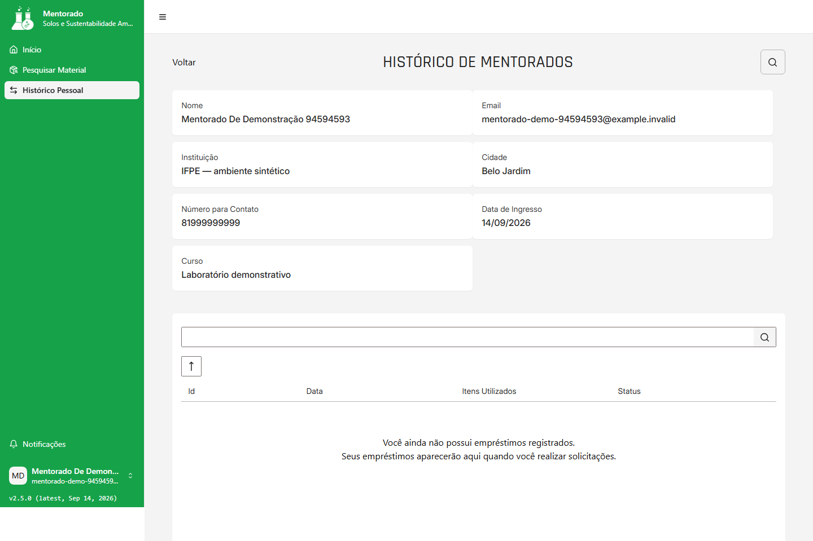
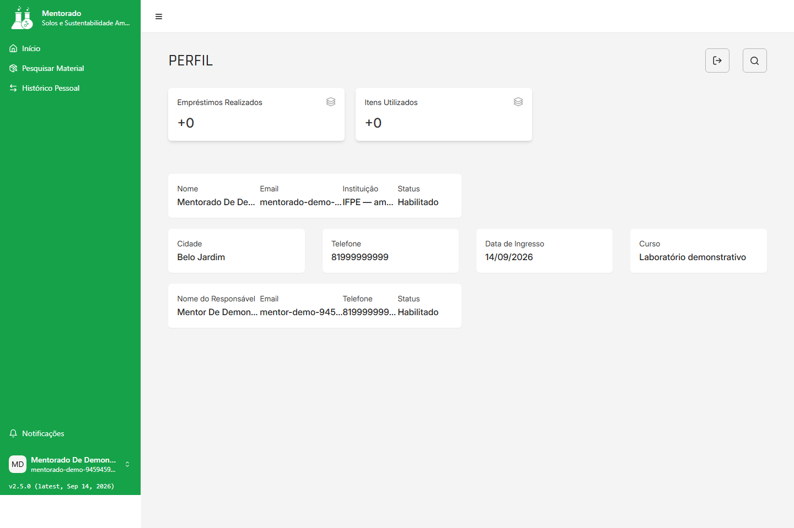

# Manual do Mentorado

Este guia descreve as ações disponíveis ao perfil `Mentorado`: consultar materiais, acompanhar seus próprios empréstimos e consultar seus dados de perfil. O perfil não possui no menu uma ação de criação, aprovação, recusa ou devolução de empréstimo.

Para entrar ou resolver problemas de credencial, consulte [Acesso e conta](acesso-e-conta.md#j04-primeiro-acesso). Para encerrar a sessão, use [senha e saída](acesso-e-conta.md#j05-senha-saida).
Volte ao [índice do manual](README.md#visao-geral) para escolher outra jornada ou perfil.

Versão do manual: `2026-09-14.2`

Produto validado: `2c78dbe1c3ec41f4004f53c42be8fed556080192`

Atualizado em: `2026-09-14`

Responsável pela revisão: `nathannmvr`

## J07 — Consultar materiais

### Quem pode executar

O Mentorado habilitado pode pesquisar e consultar os materiais disponíveis na visão de consulta. Não há edição, cadastro ou ação administrativa nesta jornada.

### Pré-requisitos

- Conta de Mentorado habilitada e sessão ativa.
- Catálogo de materiais disponível.

### Onde começar

No menu lateral, abra **Pesquisar Material**.

### Passos

1. Digite parte do nome do material no campo de pesquisa, se quiser filtrar a lista.
2. Escolha **Todos**, **Vidrarias**, **Químicos** ou **Outros** para restringir o tipo.
3. Use o controle de ordenação para alternar a ordem da lista.
4. Selecione uma linha para abrir **Verificação**.
5. Consulte os dados apresentados e use **Voltar** para retornar à pesquisa.

### Resultado esperado

Os materiais correspondentes aparecem na lista e o detalhe **Verificação** mostra a visão de consulta do Mentorado, sem ações administrativas.

### Erros comuns

- **Nenhum dado disponível para exibição** pode ser resultado do filtro, do nome pesquisado ou de falha no carregamento; limpe os filtros antes de concluir que não existe material.
- Se um material esperado continuar ausente, trate a lista vazia como resultado inconclusivo e informe a indisponibilidade. A tela pode não mostrar um erro ou botão de nova tentativa para essa falha.
- Um detalhe que não carregue deve ser abandonado com **Voltar**, sem tentar alterá-lo.

### Saída segura

No detalhe, use **Voltar** para retornar a **Pesquisar Material**. Use **Conta > Sair** quando precisar encerrar a sessão. O Mentorado não deve tentar transformar esta consulta em uma operação administrativa.

## J08 — Acompanhar empréstimos pessoais

### Quem pode executar

O Mentorado habilitado pode consultar somente os próprios empréstimos e abrir seus detalhes. Esta tela é de acompanhamento; não oferece criação, aprovação, recusa ou registro de devolução pelo Mentorado.

### Pré-requisitos

- Sessão de Mentorado ativa.
- Para visualizar linhas, deve existir pelo menos um empréstimo próprio retornado pelo sistema.
- Para abrir um detalhe, selecione uma linha existente no histórico.

### Onde começar

No menu lateral, abra **Histórico Pessoal**. A tela pode apresentar o título **Histórico de Mentorados**, mas este é o histórico pessoal acessado pelo menu do Mentorado.

### Passos

1. Aguarde o carregamento do histórico pessoal.
2. Use o campo de pesquisa para localizar uma data e o controle de ordenação para organizar os registros.
3. Confira a data, a quantidade de itens e o status exibidos.
4. Selecione o empréstimo para abrir o detalhe.
5. Consulte o status, o Mentorado vinculado e os produtos selecionados, incluindo as informações apresentadas para os itens.
6. Use **Voltar** para retornar ao **Histórico Pessoal**.

### Resultado esperado

O histórico mostra os empréstimos próprios e seus status. O detalhe permite consultar os itens sem alterar a solicitação e sem criar uma nova operação.

### Erros comuns

- **Você ainda não possui empréstimos registrados.** Essa mensagem é o resultado esperado para uma conta sem empréstimos; eles aparecerão quando houver uma solicitação registrada para o usuário.
- **Nenhum empréstimo encontrado para os filtros aplicados.** Limpe a pesquisa ou ajuste a ordenação antes de concluir que o histórico está vazio.
- Em um detalhe sem identificador selecionado, a tela informa **Selecione um registro para consultar**; volte ao histórico e escolha uma linha.
- Se o detalhe falhar, use **Tentar novamente** quando o controle estiver disponível ou navegue para o histórico pessoal pelo retorno oferecido. Uma falha de carregamento não deve ser interpretada como ausência de empréstimos.

### Saída segura

Use **Voltar** para o **Histórico Pessoal** ou para a área do Mentorado. Se a sessão não puder continuar, use **Conta > Sair**. Para solicitar um empréstimo, siga o processo institucional que envolva um Mentor; não tente criar a operação por uma tela não oferecida ao seu perfil.

## J10 — Consultar o próprio perfil e vínculo

### Quem pode executar

O Mentorado habilitado pode consultar seus próprios dados, indicadores e o vínculo com o responsável. A tela é somente de leitura e não oferece gestão de outros usuários.

### Pré-requisitos

- Sessão de Mentorado ativa.
- Vínculo com um responsável já registrado para que os dados do responsável possam ser apresentados.

### Onde começar

Abra o menu com seu nome e escolha **Conta**; o destino apresenta a página **Perfil**. Quando a navegação oferecer o atalho **Meu perfil**, ele leva ao mesmo contexto.

### Passos

1. Confira nome, e-mail, instituição e status apresentados no perfil.
2. Consulte cidade, telefone, data de ingresso e curso.
3. Confira os dados do responsável, como nome, e-mail, telefone e status do vínculo.
4. Leia os indicadores **Empréstimos Realizados** e **Itens Utilizados**.
5. Para acompanhar um empréstimo específico, retorne ao **Histórico Pessoal** e abra o registro correspondente.

### Resultado esperado

O perfil apresenta os dados pessoais e acadêmicos disponíveis, o responsável associado e os totais calculados a partir dos empréstimos próprios. Valores zerados podem ser legítimos quando ainda não há empréstimos ou itens registrados.

### Erros comuns

- Um campo exibido como não informado significa que não há valor disponível para aquele dado; não altere o cadastro por esta tela.
- Indicadores zerados não significam, sozinhos, que o vínculo esteja ausente.
- Se vários dados inesperadamente não carregarem, retorne à área do Mentorado e tente a consulta novamente. Uma tela com valores vazios não comprova que os dados foram removidos.
- O perfil não oferece `Aprovar`, `Recusar`, `Aceitar`, `Rejeitar` ou `Registrar Devolução` para o Mentorado.

### Saída segura

Use **Conta > Sair** para encerrar a sessão. Para voltar ao acompanhamento, abra **Histórico Pessoal**. Não tente alterar o perfil ou acessar operações administrativas por endereço ou interface técnica.
