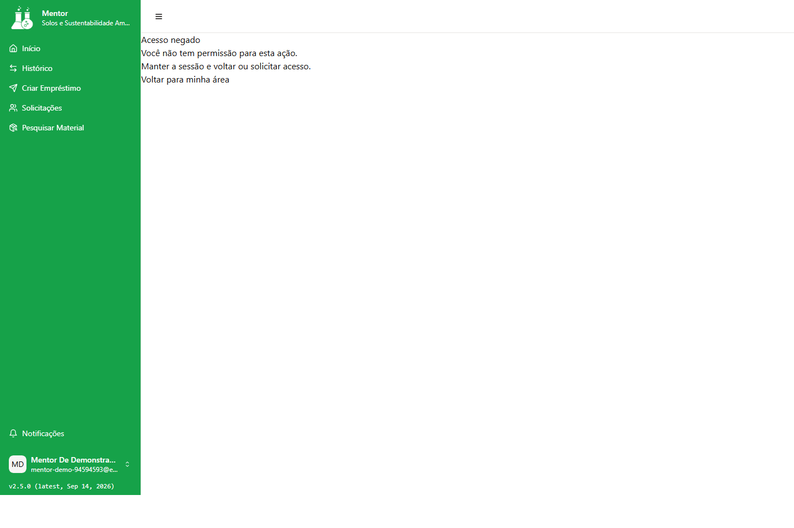

# Solução de problemas

Versão do manual: `2026-09-14.2`

Produto validado: `2c78dbe1c3ec41f4004f53c42be8fed556080192`

Atualizado em: `2026-09-14`

Responsável pela revisão: `nathannmvr`

## J11 — Recuperar-se de falhas

**Quem pode executar:** Administrador, Mentor e Mentorado que encontrem erro, lista vazia, acesso negado, recurso inexistente ou sessão inválida.

**Pré-requisitos:** manter a mensagem visível, saber a área do perfil e não registrar credenciais, tokens ou cookies.

**Onde começar:** alerta, mensagem ou retorno apresentado pela tela.

**Passos:** siga a lista numerada desta seção.

**Resultado esperado:** a pessoa distingue erro de lista vazia e retorna ao contexto correto ou ao login.

**Erros comuns:** repetir alteração sem conferir, apagar dados do navegador ou tentar outra rota para obter permissão.

**Saída segura:** use `Voltar`, `Tentar novamente`, `Conta > Sair` ou o canal de suporte, conforme o contexto.

Esta jornada vale para **Administrador**, **Mentor** e **Mentorado**. A mensagem e os controles que aparecem na tela orientam o próximo passo; não use uma ausência de registros, uma tela vazia ou uma rota conhecida como prova de que a operação foi concluída.

### Quem pode executar

Qualquer pessoa que esteja usando o LabOn e encontre uma lista vazia, uma mensagem de erro, acesso negado, recurso inexistente ou uma sessão que não possa continuar.

### Pré-requisitos

- Saber em qual área estava trabalhando: Administrador, Mentor ou Mentorado.
- Manter a página e a mensagem exibidas até identificar a categoria do problema.
- Se houver um **Código de referência**, preservá-lo para o suporte sem copiar credenciais, tokens ou links de recuperação.
- Para tentar novamente uma alteração, conferir primeiro se a operação não foi concluída apesar da mensagem.

### Onde começar

Comece pela mensagem em destaque. Quando houver um alerta com **Tentar novamente**, use-o somente para uma falha que possa ser repetida. Quando houver **Voltar**, retorne à página pai, à pesquisa, ao histórico ou à área do seu perfil.

### Passos

1. Leia o título, a descrição e a ação sugerida pela mensagem.
2. Verifique se a situação é uma lista sem registros ou uma falha de carregamento; use a seção [lista vazia ou erro](#lista-vazia-ou-erro).
3. Para rede, demora ou serviço indisponível, use [Tentar novamente](#tentar-novamente) quando o botão estiver disponível.
4. Para **Acesso negado**, recurso ausente ou sessão expirada, siga a seção correspondente e use o retorno oferecido pela tela.
5. Se uma ação de alteração tiver produzido uma resposta ambígua, volte à lista ou ao histórico e confirme o status antes de repetir.
6. Se o problema persistir, registre a mensagem sanitizada, a área do perfil e o contexto da operação e procure o suporte pelo canal da instituição.

### Resultado esperado

Você identifica se deve corrigir um campo, tentar novamente, voltar à página anterior, autenticar-se outra vez ou pedir suporte. O retorno leva à área correta do perfil ou ao ponto de pesquisa/histórico relacionado, sem transformar uma falha em uma ação nova.

### Erros comuns

- Tratar uma lista vazia como prova de que não há registros.
- Reenviar uma aprovação, empréstimo, devolução ou cadastro antes de conferir seu estado.
- Tentar abrir uma área de outro perfil porque uma ação apareceu em uma tela compartilhada.
- Continuar preenchendo uma página depois que a sessão foi encaminhada ao login.
- Alterar manualmente o endereço da página para obter uma opção que não aparece no menu.

### Saída segura

Use **Voltar** para a página pai ou para sua área. Se a sessão tiver expirado, autentique-se novamente ou use a recuperação de senha. Se não houver uma saída contextual, selecione **Conta > Sair** quando essa opção estiver disponível. Não informe credenciais em uma tela inesperada e não faça alterações manuais no navegador para tentar reparar a sessão.

## Lista vazia não é o mesmo que erro

### Lista vazia

Uma lista vazia pode ser um resultado válido quando ainda não há solicitações, vínculos, materiais visíveis ou empréstimos associados ao perfil. Confira o título da página, filtros, vínculo e estado da conta. Em uma lista que carregou sem alerta, não crie registros apenas para testar a tela.

Há telas em que uma falha de carregamento pode deixar a lista vazia sem mostrar um alerta equivalente. Isso é conhecido nas consultas de materiais, turma, desativados e criação de empréstimo. Se você esperava um registro conhecido e só vê uma lista vazia, trate o caso como falha a confirmar: não conclua que o serviço não possui dados e não repita uma alteração por causa disso.

### Erro explícito

Um alerta com uma mensagem como **Não foi possível concluir a operação** ou **Não foi possível conectar ao serviço** indica uma falha, não uma lista sem dados. Leia a ação sugerida, confira o estado antes de reenviar e siga [Tentar novamente](#tentar-novamente) ou [Voltar](#retorno-por-perfil).

## Rede, demora e erro do serviço

Use **Tentar novamente** quando esse controle aparecer para uma falha de rede, demora ou indisponibilidade do serviço. A tentativa é apropriada para uma consulta que ainda não carregou; em ações que alteram dados, confirme primeiro o resultado na lista ou no histórico.

- **Falha de conexão:** confira a conexão indicada pela instituição e tente novamente uma vez quando a tela oferecer o controle.
- **Serviço demorou:** aguarde e use **Tentar novamente**. Se persistir, volte à área do perfil e acione o suporte.
- **Serviço não concluiu a operação:** não presuma que nada foi salvo. Para aprovação, cadastro, empréstimo ou devolução, consulte o registro antes de repetir.
- **Conflito ou registro já processado:** atualize o contexto usando a lista ou o histórico e escolha uma ação compatível com o novo status.

Se não houver o botão **Tentar novamente**, use **Voltar** para retornar ao contexto anterior. A ausência do botão não autoriza repetir a ação por outro endereço.

## Acesso negado ou acesso indisponível

### Acesso negado

**Acesso negado** significa que a sessão válida não tem permissão para a área ou ação solicitada. Se a tela oferecer **Voltar para minha área**, selecione esse controle. Ele retorna à área correspondente ao seu perfil.

Não troque o endereço da página, não tente chamar a operação por fora do menu e não use a conta de outra pessoa. Para conferir o que está disponível, abra [Perfis e permissões](perfis-e-permissoes.md#perfis).

### Acesso indisponível

**Acesso indisponível** indica um nível de acesso que não possui módulo suportado. Use **Sair** para encerrar a sessão e procure o responsável pelo cadastro. O manual cobre somente Administrador, Mentor e Mentorado.

## Página ou recurso inexistente

Quando aparecer **Página não encontrada**, ou quando um detalhe informar que o recurso não foi encontrado, selecione **Voltar**. Retorne à pesquisa, à lista ou ao histórico de onde o registro foi aberto e selecione um item que ainda esteja disponível.

Se a tela informar que é necessário selecionar um registro ou que o identificador não é válido, não tente completar o endereço manualmente. Use a navegação visível. Para uma consulta específica, volte a [Pesquisar material](administrador.md#j07-materiais-admin), [consultar materiais como Mentor](mentor.md#j07-consulta-materiais-mentor) ou [consultar materiais como Mentorado](mentorado.md#j07-consulta-materiais-mentorado).

## Sessão expirada ou inválida

Quando a sessão expira ou deixa de ser válida, uma área protegida encaminha você para a tela de login. O sistema pode preservar o destino pretendido para depois da nova autenticação.

1. Pare de preencher a página protegida e confirme que está na tela de login.
2. Entre novamente com a credencial atual recebida por canal autorizado.
3. Se houver troca obrigatória de senha, conclua [o primeiro acesso](acesso-e-conta.md#j04-primeiro-acesso) antes de voltar à área.
4. Se não lembrar a senha, use [recuperação de senha](acesso-e-conta.md#j05-senha-saida).
5. Se não for possível autenticar, permaneça no login e procure o suporte. Não reutilize uma tela protegida ou um valor de sessão antigo.

Após a nova autenticação, confirme a área do perfil antes de repetir a operação. Se o destino pretendido não puder ser retomado, use o menu correspondente: [Administrador](README.md#percurso-administrador), [Mentor](README.md#percurso-mentor) ou [Mentorado](README.md#percurso-mentorado).

## Retorno seguro por perfil

- [Administrador: preparação e operação](administrador.md#j06-preparar-operacao)
- [Mentor: turma, materiais e empréstimos](mentor.md#j10-turma-mentor)
- [Mentorado: consulta e acompanhamento](mentorado.md#j10-perfil-mentorado)
- [Acesso e conta](acesso-e-conta.md#j05-senha-saida)
- [Índice do manual](README.md#visao-geral)

Se uma inconsistência da interface impedir a jornada — por exemplo, uma lista de desativados que não corresponde ao contexto ou uma decisão de empréstimo oferecida ao Mentor — preserve a mensagem e o contexto, não use a ação incompatível e reporte o caso ao responsável pela revisão do produto. Este manual não corrige nem oferece contornos para essas inconsistências.
